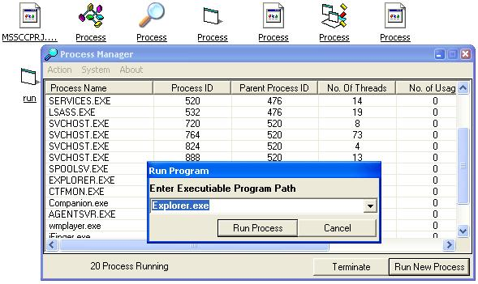



## Process Manager for Win9X\-ME

### Description

It shows all the running process including background process not even shown by CTRL+ALT+DEL task manager.Also shows use of sendmessage api to commuincate with other application.Helps you to find virus,trojan in your computer..
 
### More Info
 
Use of API

             |
---                |---
**Submitted On**   |2003-09-17 23:27:54
**By**             |[Puspa](https://github.com/Planet-Source-Code/PSCIndex/blob/master/ByAuthor/puspa.md)
**Level**          |Beginner
**User Rating**    |4.8 (19 globes from 4 users)
**Compatibility**  |VB 4\.0 \(32\-bit\), VB 5\.0, VB 6\.0
**Category**       |[Complete Applications](https://github.com/Planet-Source-Code/PSCIndex/blob/master/ByCategory/complete-applications__1-27.md)
**World**          |[Visual Basic](https://github.com/Planet-Source-Code/PSCIndex/blob/master/ByWorld/visual-basic.md)
**Archive File**   |[Process\_Ma1646609172003\.zip](https://github.com/Planet-Source-Code/puspa-process-manager-for-win9x-me__1-48587/archive/master.zip)

